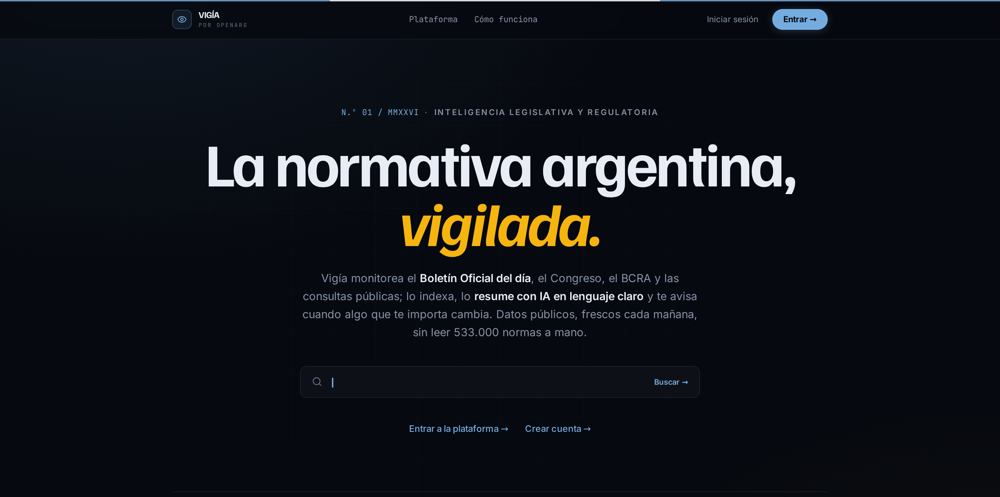

  

<h1 align="center">Vigía — Inteligencia Legislativa y Regulatoria</h1>

  <strong>La normativa argentina, vigilada.</strong> 
  Monitoreo del Boletín Oficial, el Congreso y el sector público — en tiempo real y en lenguaje claro.

  <a href="https://vigia.openarg.org"><strong>🔗 Abrir Vigía → vigia.openarg.org</strong></a> 
  Proyecto open source de <a href="https://colossuslab.com.ar">Colossus Lab</a> · familia <a href="https://openarg.org">OpenArg</a> · Licencia MIT

---

## ¿Qué es Vigía?

Vigía centraliza, analiza y alerta sobre toda la producción normativa argentina. En vez de leer
el Boletín Oficial a mano, accedés a un solo radar que ingesta **533.000+ normas** de ocho fuentes
oficiales, las resume con IA en lenguaje claro y te avisa cuando algo que te importa cambia.

Pensado para **empresas, estudios jurídicos y áreas de compliance** que necesitan saber, cada
mañana, qué se publicó y a quién afecta — sin ruido.

> **Empezá ahora:** entrá a **[vigia.openarg.org](https://vigia.openarg.org)**. El feed, el buscador
> y las estadísticas son **públicos** (no requieren cuenta). Crear una cuenta gratuita habilita las
> alertas por email y un workspace para tu equipo.

---

## Guía de uso

Vigía son **seis módulos, un solo radar**. Así se usa cada uno:

### 📰 Feed Normativo — `/feed`
El Boletín del día como un diario: lo importante arriba, el trámite colapsado. Cada norma nueva
viene con su **resumen IA** en lenguaje claro (qué resuelve y a quién afecta), su tipo (DNU, decreto,
ley, resolución, proyecto…), organismo y sector.

> **Tip:** filtrá por tipo o sector para quedarte solo con lo que te incumbe.

### 🔎 Buscador — `/search`
Búsqueda **full-text en español** sobre todo el corpus normativo. Escribí en lenguaje natural y
obtené resultados rankeados con snippets resaltados. Combiná con filtros por tipo, sector y
jurisdicción para acotar.

### 🔔 Alertas — `/alerts`  *(requiere cuenta)*
Suscribite por **keyword y sector**. Cuando una norma, comunicación o edicto matchea tu criterio,
te llega un **digest por email**. Ideal para vigilar un tema regulatorio, un organismo o una
palabra clave de tu industria sin revisar el feed todos los días.

1. Iniciá sesión y entrá a **Alertas**.
2. Creá una alerta con tus keywords y/o sectores.
3. Vigía hace el matching automáticamente (cada hora) y te notifica.

### 🛡️ Tracker DNU — `/dnu`
Seguimiento de cada **Decreto de Necesidad y Urgencia** con su estado bicameral real: dictaminados,
pendientes y sin tratamiento, derivado de los datos del Congreso.

### 🏢 Radar societario — `/avisos`
La **2ª sección del Boletín**, buscable: constituciones, asambleas y edictos societarios. Vigilá una
empresa por razón social y enterate de sus movimientos.

### 📊 Estadísticas — `/dashboard`
El pulso normativo en números: actividad por tipo y sector, organismos más activos y tendencias de
producción legislativa.

### 👤 Cuenta, workspaces y prueba gratuita
- **Modo demo:** sin login, con acceso público a los datos (feed, buscador, stats).
- **Cuenta gratuita:** habilita alertas y un **workspace** para tu equipo (miembros e invitaciones).
- **Prueba gratuita:** 30 días por workspace para las funciones gestionadas; al vencer se solicita
  pasar a un plan de miembro.

---

## Fuentes de datos

Datos **públicos y verificables**, refrescados cada mañana con SLOs de frescura por fuente:

- **Boletín Oficial (BORA)** — 1ª sección (normas) y 2ª sección (avisos societarios)
- **InfoLEG** — base de legislación nacional (Min. de Justicia)
- **HCDN — Diputados** — proyectos, movimientos y dictámenes
- **Comisión Bicameral de DNU** — estado de tratamiento
- **BCRA** — Comunicaciones "A"
- **Consultas públicas** nacionales

---

## Licencia

Este proyecto se distribuye bajo la [Licencia MIT](LICENSE).
